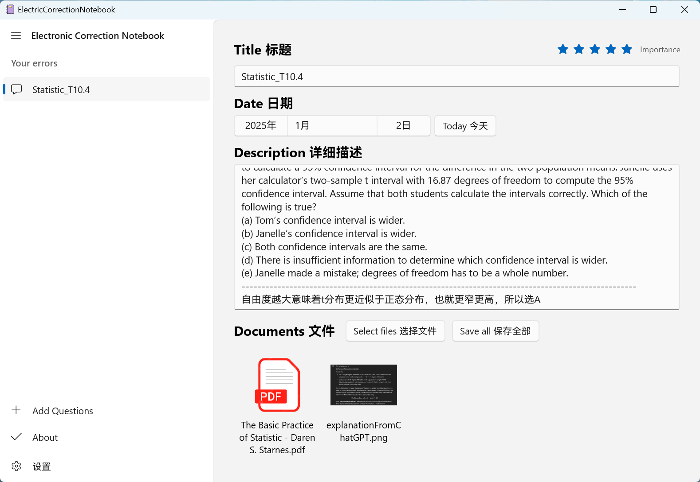
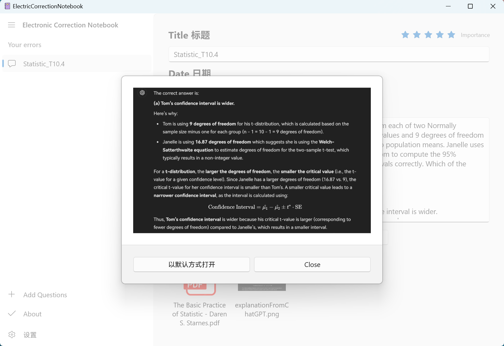
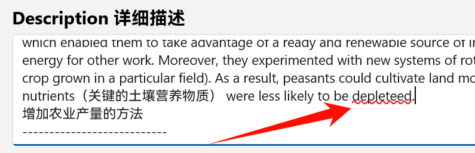
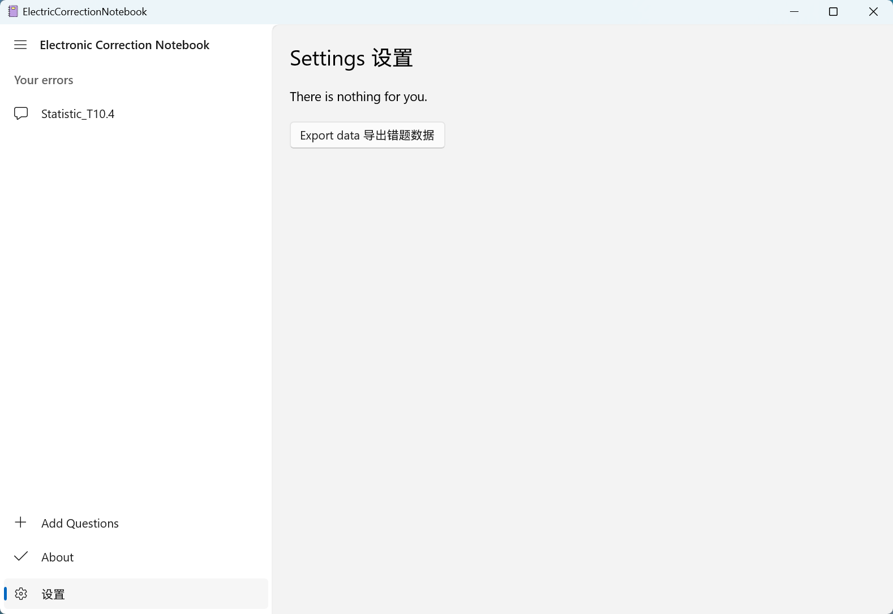
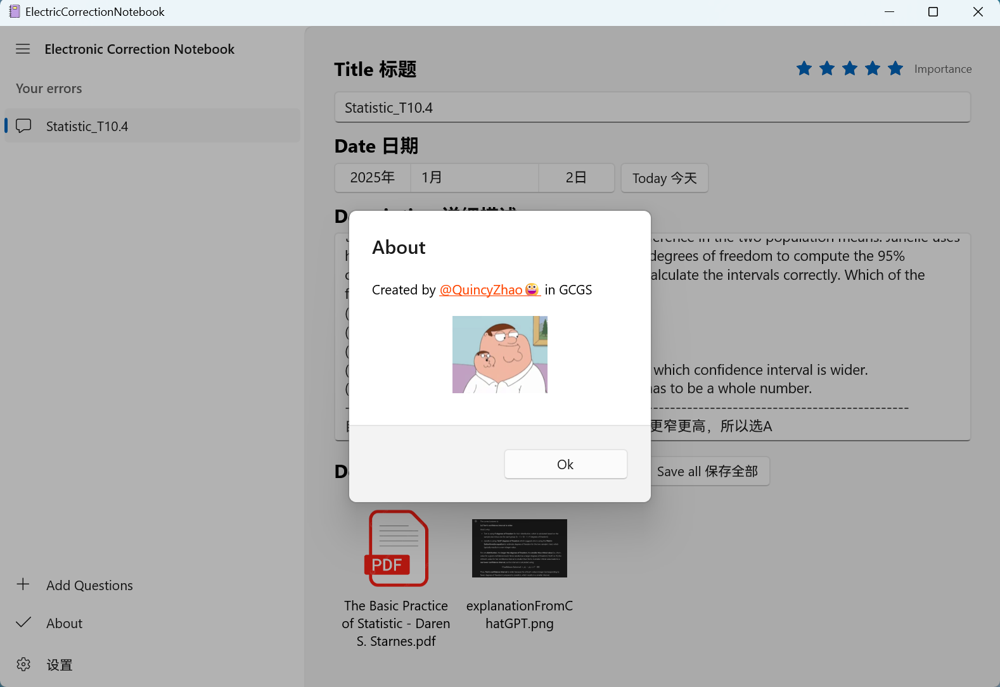

# ElectronicCorrectionNotebook Windows端电子错题本
**A windows Electronic Correction Notebook, used to record your mistakes in exams and homework   
Windows端电子错题本**

**作者信息：高三再读，等待申请的时候没事干，写了这个小软件，希望对大家有所帮助**   
**Developer/Author：Grade 12 in international high school in CHINA, waiting for offers of universities....**

## 未来计划 持续更新中...🚩   

1. 🎁新增文件夹功能，实现文件夹管理
2. 🎁新增图片/文件从剪贴板粘贴功能
3. 🎁新增粘贴链接🔗功能
4. 🎁新增删除page或文件的功能  
5. 🎁新增黑暗/明亮主题   
6. 🎁新增自定义颜色主题   
7. 🎁新增Description标注功能（高亮，下划线，加粗，颜色等）   
~~1. 🎁新增添加文件功能~~   （已实现）    
~~6. 🎁新增标星/重要度标记功能~~ （已实现）    
  

## 🎁Main Page 主页面

## 🎁Image Dialog 图片查看

## 🎁Auto Spell Check 拼写检查
### 得益于WinUI3的API，可以实现自动英文拼写检查

## 🎁Settings 设置
### 可实现笔记备份保存

## 🎁About 关于

