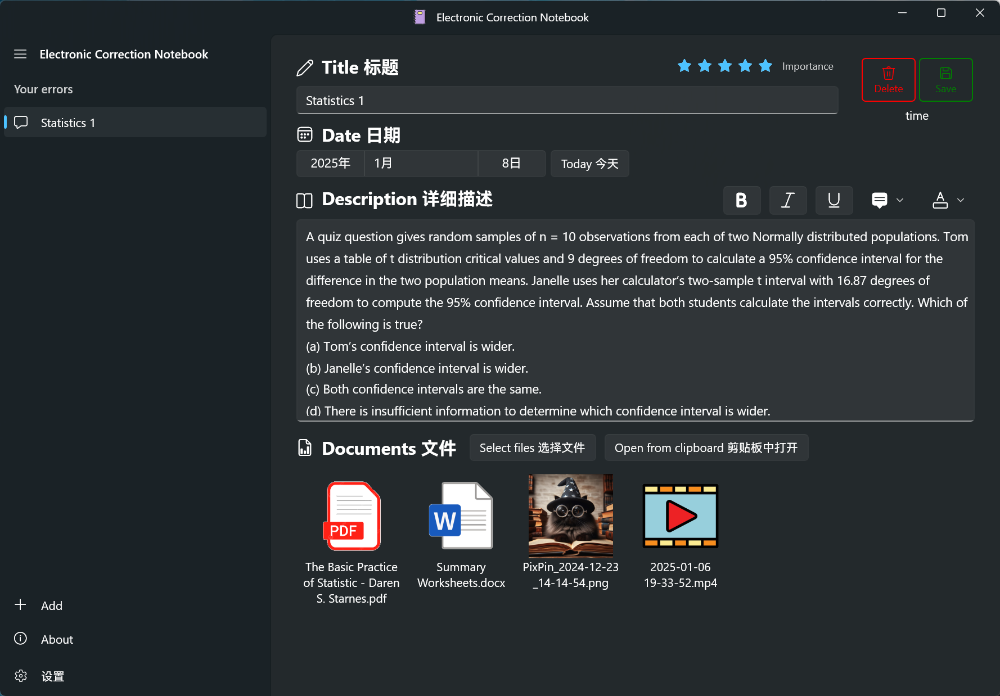
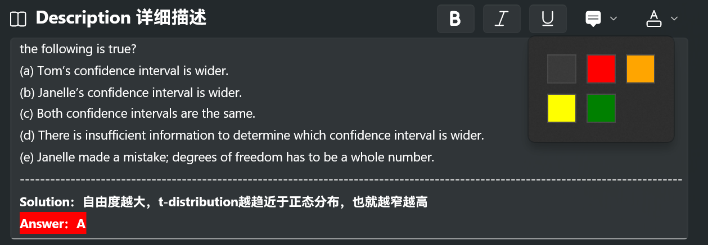
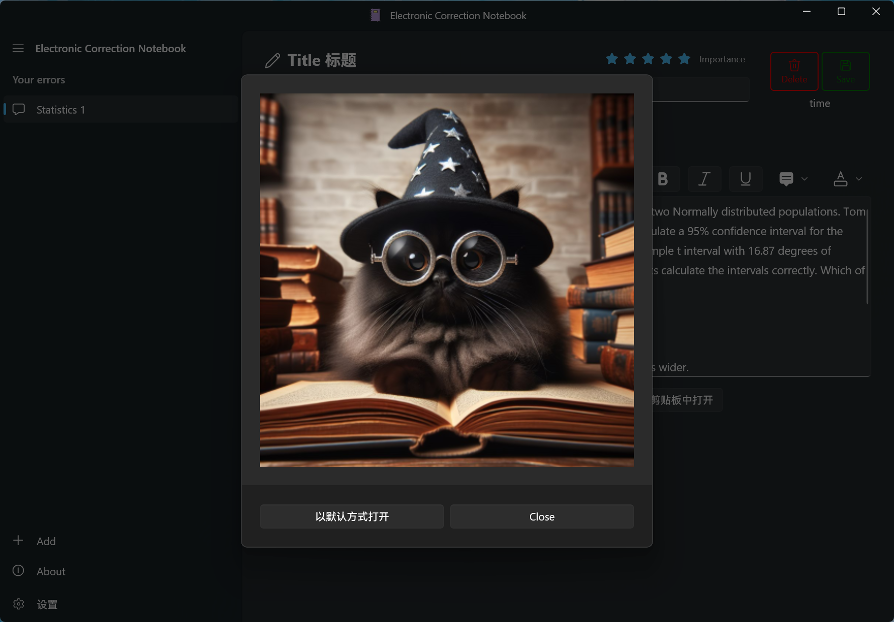
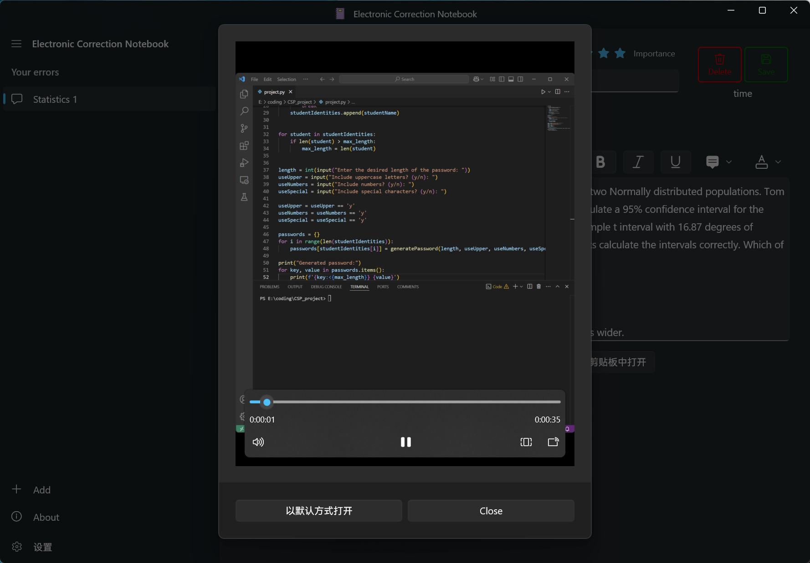
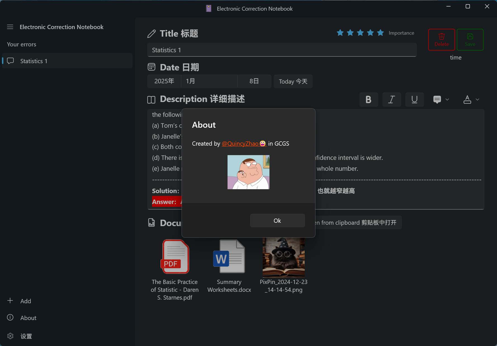

# ElectronicCorrectionNotebook Windows端电子错题本
### A windows Electronic Correction Notebook, used to record your mistakes in exams and homework 
### Windows端电子错题本📘📘📘

### 关于我：高三再读，等待申请的时候没事干，写了这个小软件，希望可以辅助大家偷偷内卷
### About me：Grade 12 in international high school in CHINA, waiting for offers of universities....

### 技术栈：WinUI3 + C# + XAML

### 未来计划 持续更新中...🚩   

1. 🔥新增文件夹功能，实现文件夹管理  
2. 🔥新增粘贴链接🔗功能   
3. 🔥新增黑暗/明亮主题      
4. 🔥新增自定义颜色主题   

~~2. 🔥新增图片/文件从剪贴板粘贴功能~~ （已实现）   
~~4. 🔥新增删除page或文件的功能~~ （已实现）      
~~7. 🔥新增Description标注功能（高亮，下划线，加粗，颜色等)~~    (已实现，但控件有bug，等待官方修复)   
~~1. 🔥新增添加文件功能~~   （已实现）       
~~6. 🔥新增标星/重要度标记功能~~ （已实现）       
  

## 🕶️Main Page 主页面

## 📊Files 文件预览

## ⚙️Settings 设置
### 可实现笔记备份保存

## 🥰About 关于

