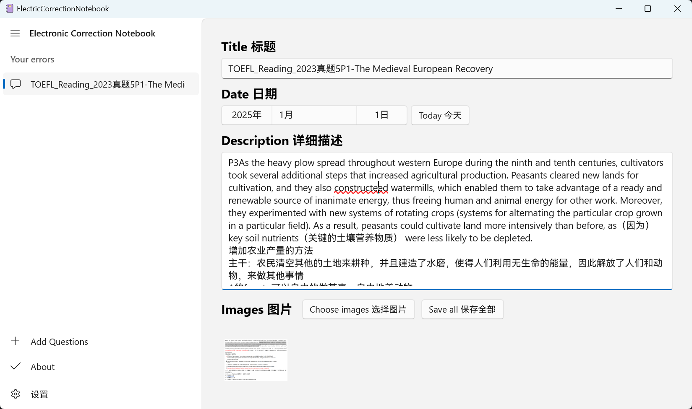
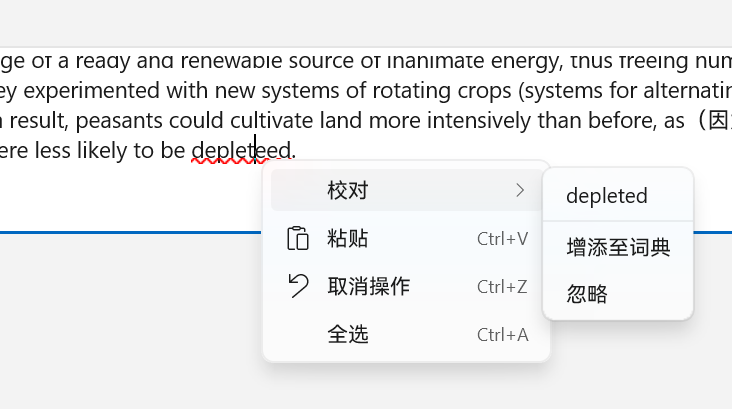

# ElectronicCorrectionNotebook
**A windows Electronic Correction Notebook, used to record your mistakes in exams and homework   
Windows端电子错题本**

## 未来计划🚩   
1. 🎁目前只有添加功能，暂无删除page或图片的功能，预计过几天开发
2. 🎁新增黑暗/明亮主题
3. 🎁新增自定义颜色主题
4. 🎁新增标星/重要度标记功能
5. 🎁新增添加各种文件功能
6. 🎁新增Description标注功能（高亮，下划线，加粗，颜色等）

## 🎁Main Page 主页面

## 🎁Image Dialog 图片查看

## 🎁Auto Spell Check 拼写检查
得益于WinUI3的API，可以实现自动英文拼写检查

## 🎁Settings 设置

## 🎁About 关于

